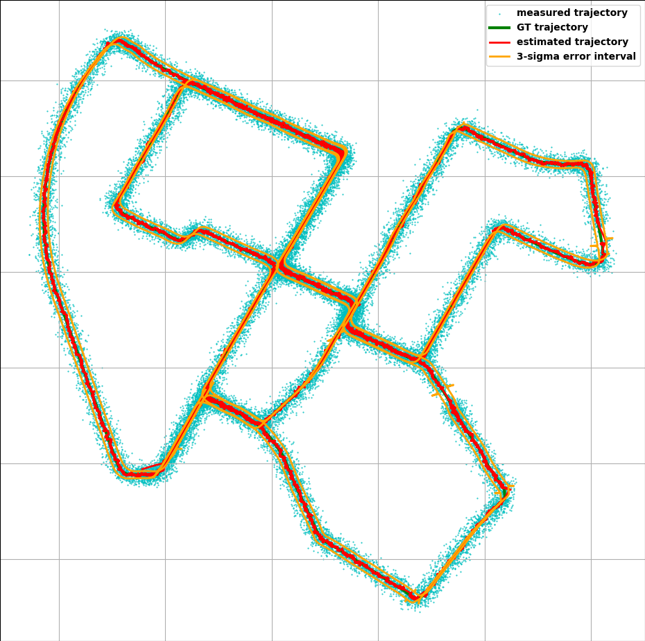
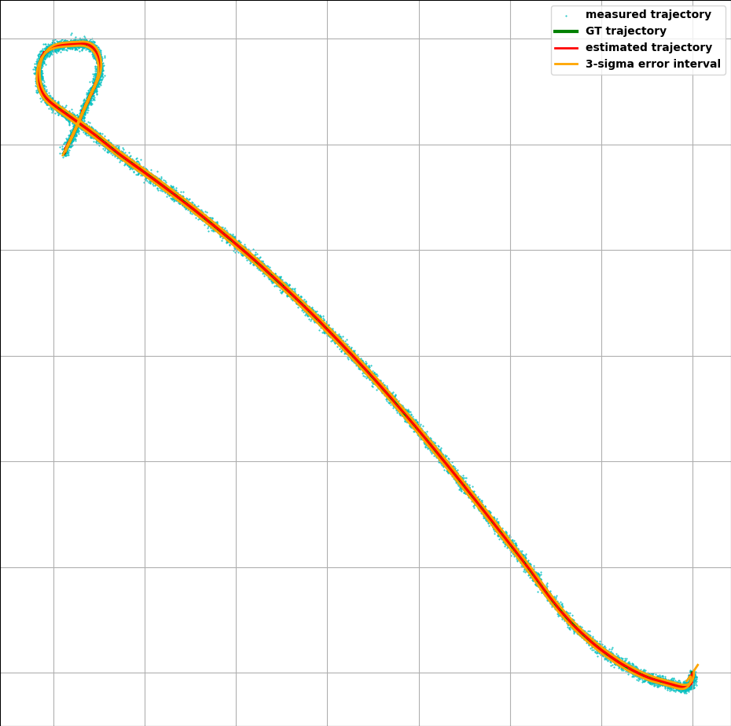
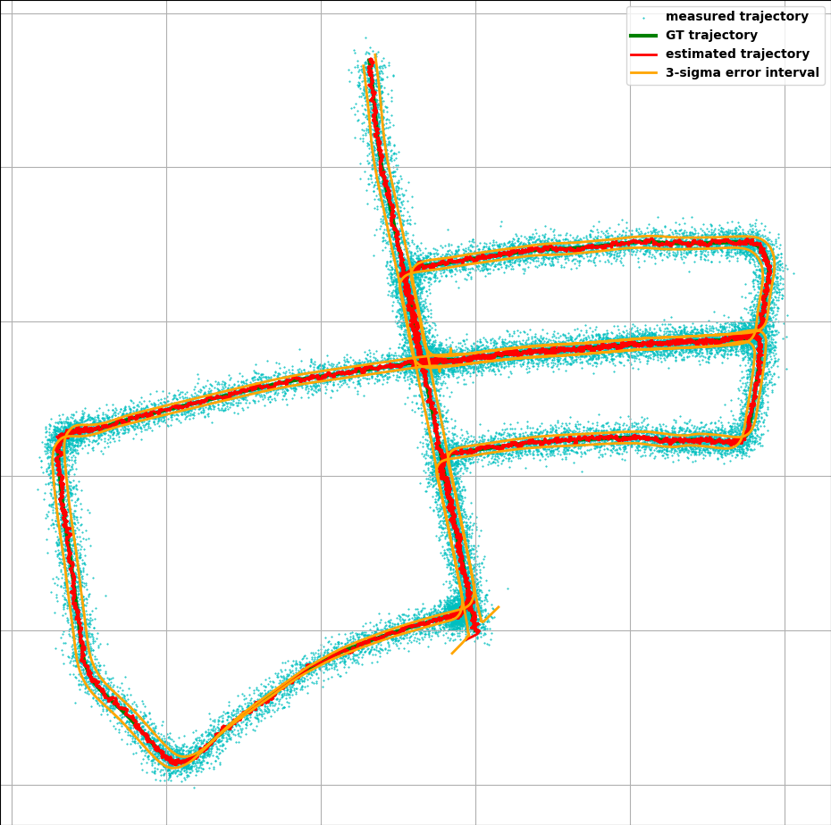
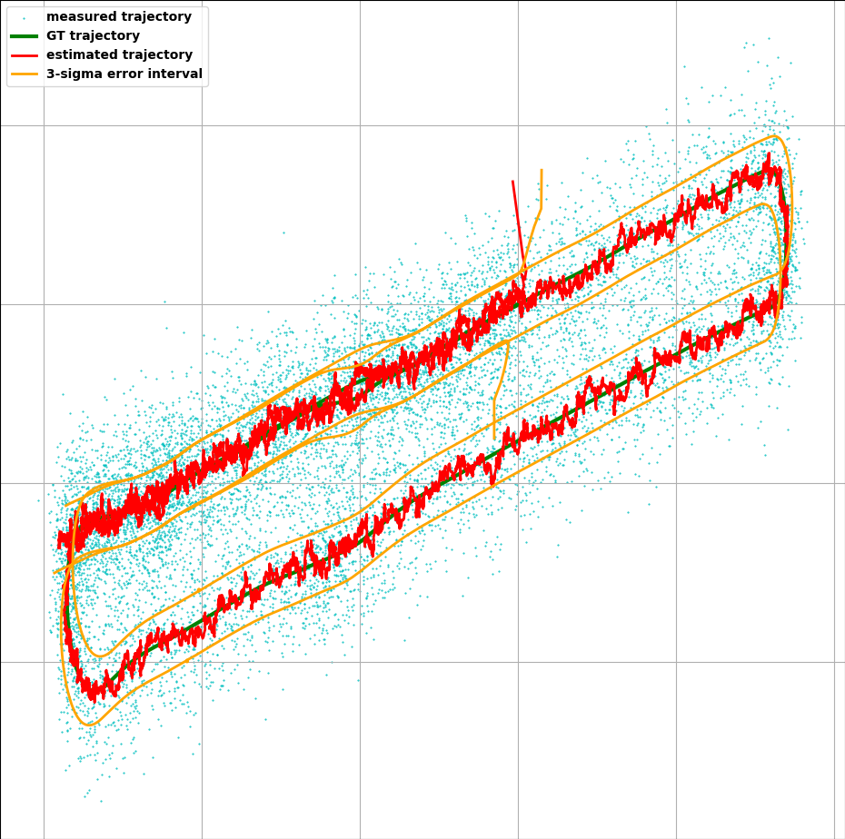
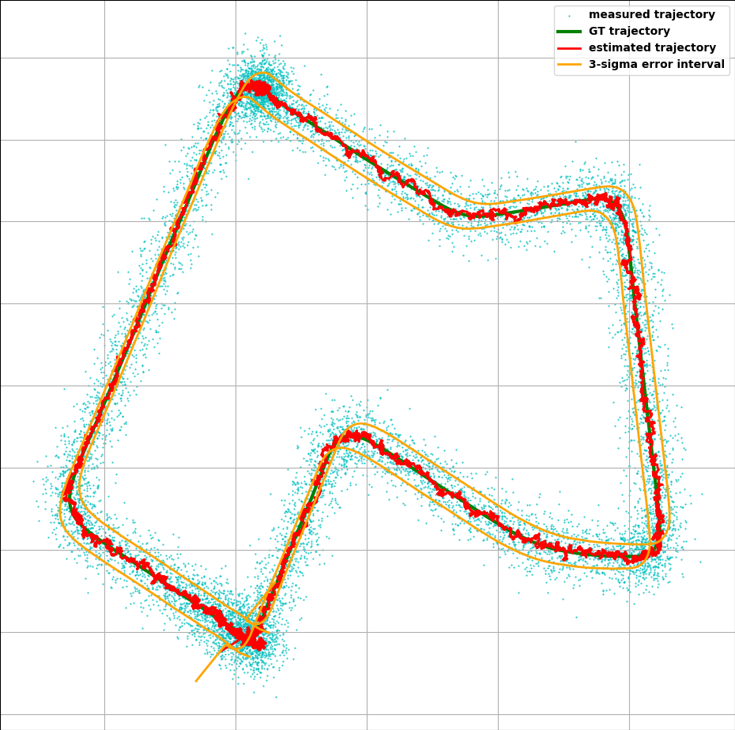
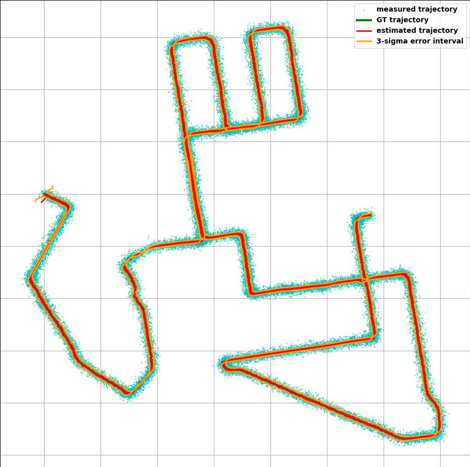

# extended_kalman_filter

The establishment of this repository aims to verify the recent advancements in SLAM through validation.

Python vanilla (of course with numpy, pandas, etc) of the Extended Kalman Filter applied to IMU data for autonomous
driving.

### Results

some results in the following context.

- Green is the GT
- Cyan points are the measured GPS values (synthetically generated) with Gaussian noise (std=5.0).
- Red is the EKF prediction/correction (mus_, vars_) or (x_, P_).
- Orange is the 3-sigma error interval. This value is also an argument (locally changed).

|        Italic        |    Block letters     |
:--------------------:|:--------------------:
  |  
  |  
  |  

# Installation

* `conda create --name kalman python=3.10`
* `conda activate kalman`
* `pip install -r requirements.txt`

Unfortunately, I cannot share the data from KITTI. But this is easy to get online in the original web :)

# Run

Just run the command.

* `python main.py --path="path/to/data/KITTI-IMU/" --idx="7"`

data here is mainly *.txt :)
# TODO

- [ ] Improve visualization in Folium to show the map visualization properly.
